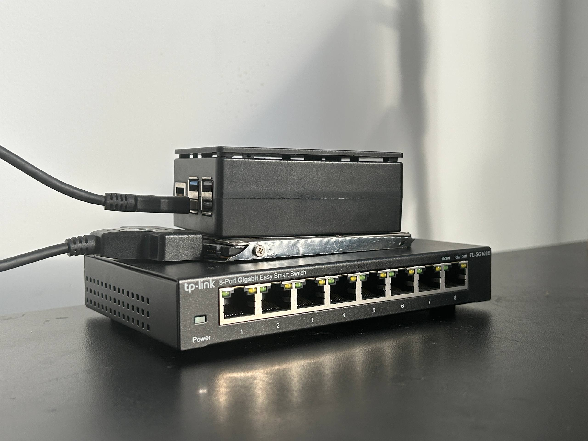

# Homelab

Personal self-hosted infrastructure running on Raspberry Pi 5. Built for learning, privacy, and full control over my data.

## Hardware

- Raspberry PI 5:
  - RAM: `8GB`
  - MMC: `64GB`
  - HDD `Seagate Momentus Thin 500GB` (From old laptop)
- TP-Link `TL-SG108E`:
  - Ports: `8`
  - Speed: `1000Mbps`

---
## Services

| Logo | Service | Purpose |
|------|---------|---------|
|  | [Portainer](https://portainer.io) | Docker / GitOps manager |
|  | [Navidrome](https://navidrome.org) | Music server |
|  | [PhotoPrism](https://photoprism.app) | Photo server |
|  | [Vaultwarden](https://github.com/dani-garcia/vaultwarden) | Password manager |
|  | [Cloudflared](https://github.com/cloudflare/cloudflared) | Secure tunneling |
|  | [Twingate](https://twingate.com) | Zero-trust VPN |
|  | Personal website | [cryobs.xyz](https://cryobs.xyz) |
---

## Roadmap
- [X] VPN (Twingate)
- [X] GitOps/Docker manager (Portainer)
- [X] Music server (Navidrome)
- [X] Photo server (PhotoPrism)
- [X] Secure tunneling (Claudflared)
- [X] My Web Site ( https://cryobs.xyz )
- [X] Password manager (Vaulwarden)
- [ ] Monitoring and alerting:
  - [ ] Metrics (Prometheus + node_exporter + cAdvisor)
  - [ ] Dashboards (Grafana)
  - [ ] Alerting (Grafana Alertmanager -> Telegram/email)
- [ ] Fully automated deploy of system
  - [ ] Ansible playbook for full restore the system
  - [ ] Secrets management (Ansible Vault or external secrets)
- [ ] Monitoring and alerting
- [ ] RAID storage setup
- [ ] GitOps (ArgoCD)
- [ ] My Own VPN (Wireguard)
- [ ] Git Server (Forgejo)
- [ ] Container registry
- [ ] DNS/Ad block (AdGuard)
- [ ] Kubernetes Cluster
- [ ] Rolling updates
- [ ] Self healing
  - [ ] Container auto-restart policies (Docker restart: unless-stopped)
  - [ ] Watchdog script for healthcheck of services
  - [ ] Auto reboot with kernel panic (systemd watchdog)
  - [ ] Health checks on all Docker containers

---

## What I Want to Improve

- Replace Portainer GitOps with proper ArgoCD workflow
- Set up automated offsite backup for PhotoPrism (irreplaceable family photos)
- Set up my own VPN with Wireguard
- Wrap all Homelab with Kubernetes

---

## Stack

`Docker` `Raspberry Pi OS` `Cloudflare` `Twingate` `Portainer`

